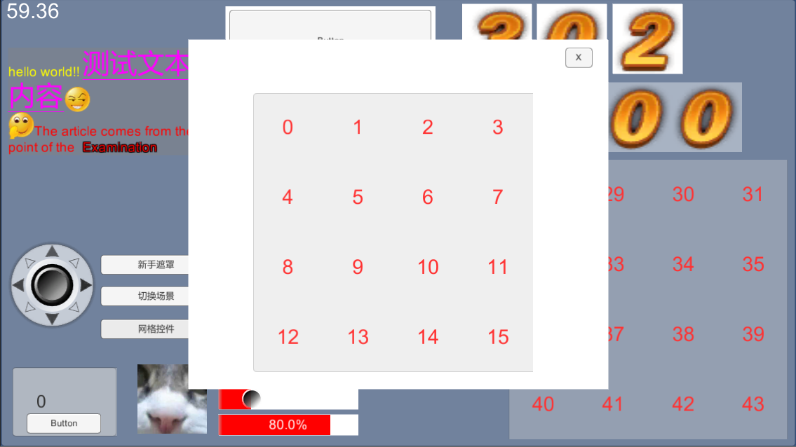

基于ugui组件封装，高级控件库uLui
====

特性
-------  
### 组件LWidget
1.LScrollView 滑动层 
2.LRichLabel 可复用的富文本 
3.LControlView 摇杆控件 
4.LGridView 网格容器 
5.LGridPageView 网格翻页容器 
6.LMovieClip 序列帧控件 
7.LPageView 翻页容器 
8.LButton 长按按钮 
9.LListView 复用列表 
10.LLabelAtlas 图集字 
11.LTableView 复用表 
12.LHUDView hud容器 
13.LSlider 滑块 
14.LProgress 进度条 
15.LExpandListView 可折叠列表 
16.LDragView 拖拽控件 
17.LSwitch 切换条 
18.LInputField 抬起输入框 

### 窗体LWindow
1.自动管理窗体层次 
2.窗体回收和缓存 
3.窗体逻辑跟控件解耦 

### 多线程网络库
整合protobuff

### 若干小工具
1.热更模块 
2.打包ab 
3.使用texturepacker图集 

### 整合Slua
1.已经可以用纯lua开发了哦  

### 运行
①普通测试 
双击运行 Assets/Resources/Scenes/start 场景即可 
②热更测试 

### 如何热更？
1.首先配置热更 
①config.txt 中修改 Debug 为 0 
②config.txt 中修改 HotFix 为 1 
③config.txt 中修改 ResUrl 为 你的cdn地址 
2.准备打包ab 
①点击菜单栏Tools->HotfixConfig，然后选择对应的平台 
②然后会生成data.zip和version.ver，把他们放到cdn服务器下准备下载 
双击运行 Assets/Resources/Scenes/start 场景即可 

什么？这个例子太复杂？请看下面热更精简版演示： 
[https://github.com/LingJiJian/UnityHotFixDemo](https://github.com/LingJiJian/UnityHotFixDemo)   

联系
-------
qq342854406  qq群347085657
